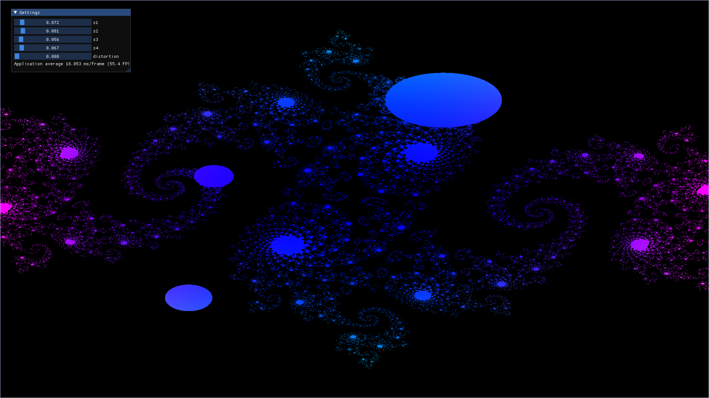

# GL_SDF

GL_SDF renders signed distance fields. It uses opengl and GLFW as the windowing library. It uses ImGui for UI and shaders for computation.

The current goal is to make the render system more modular and add a way to edit the scene. Eventually I want to add 3d SDFs and an abstract way to represent them.



## Building

``` bash
git clone https://github.com/michbogos/gl_sdf.git
cd gl_sdf
make && gl_sdf
```

GL_SDF works in Linux with X11.
Support for Windows and Web is planned.